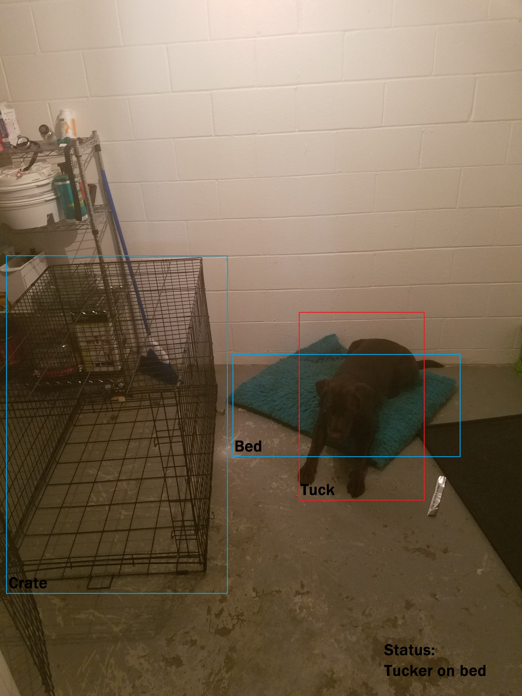

Pet tracking Project
==================================================

Description
-----------
Allows you to keep track of your pets while you're not home and cant be staring at the camera all day.

Dependacies
-----------
- OpenCV 3.1 (compiled with ffmpeg and contib)
- PyQt5
- Pandas

If you had any question do not hesitate to contact :)

Screenshots
-----------

